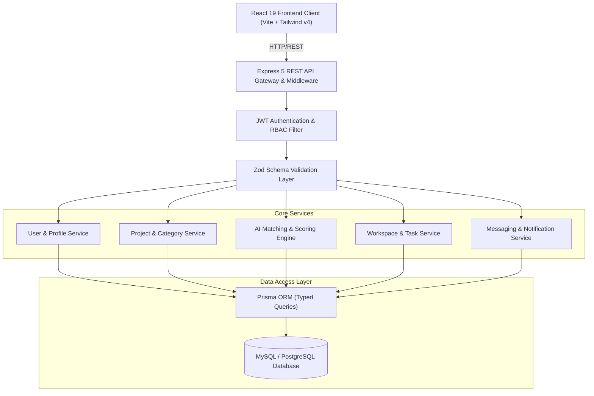
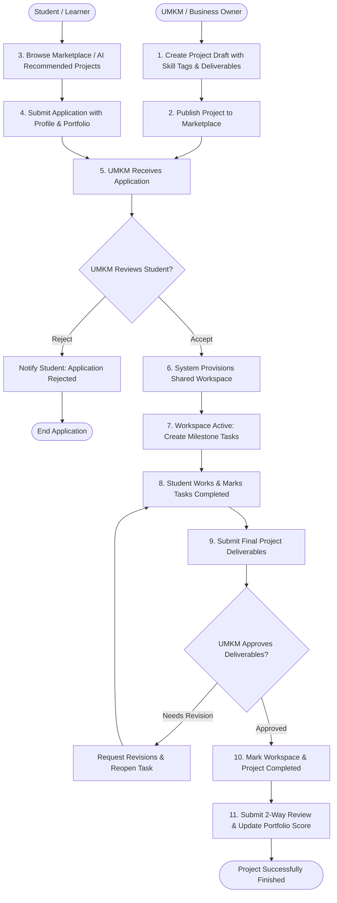
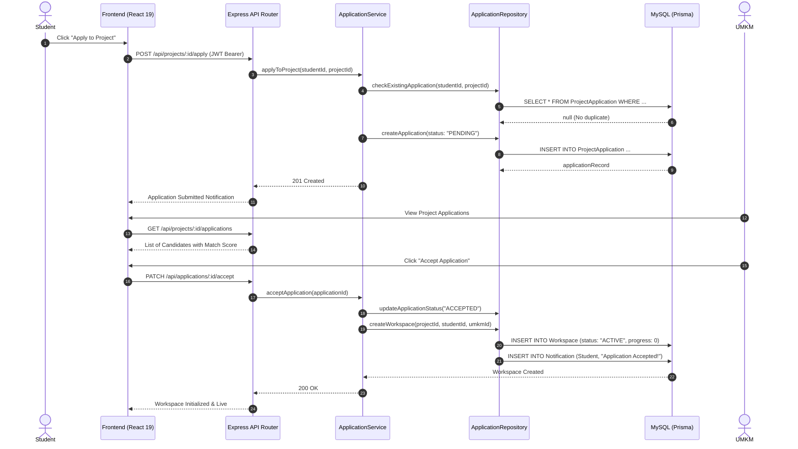
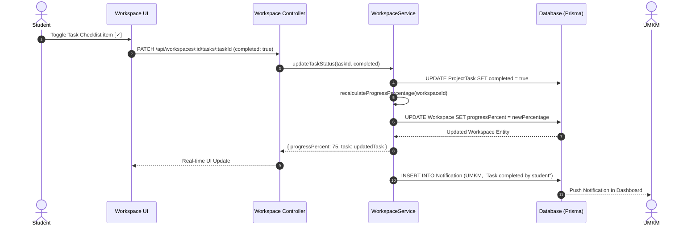
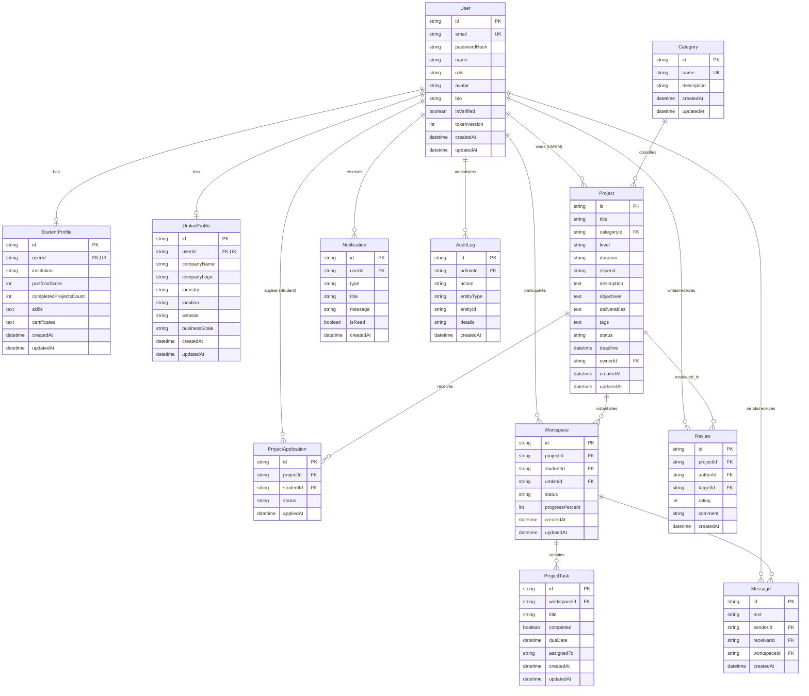

# SkillBridge — System Architecture & Technical Specifications

**Document Version:** 1.0.0  
**Project:** SkillBridge Academic & Industry Collaboration Hub  
**Author:** Ahmad Dhafin Al Farisy  
**Target Environment:** Node.js (Express 5) · React 19 · MySQL/PostgreSQL · Prisma ORM  

---

## 1. System Architecture Overview

SkillBridge facilitates end-to-end collaboration between **Students** (seeking industry experience) and **UMKM / Business Owners** (seeking technical talent). 



---

## 2. Business Process Model & Notation (BPMN)

The complete lifecycle from Project Creation to Completion and Review:



---

## 3. Sequence Diagrams

### 3.1 Sequence 1: Project Application & Workspace Provisioning



---

### 3.2 Sequence 2: Task Milestone Execution & Progress Tracking



---

## 4. Entity Relationship Diagram (ERD / RDBMS Schema)



---

## 5. Data Dictionary

### Core Tables Summary

| Table | Description | Key Relations |
| :--- | :--- | :--- |
| **`User`** | Central identity table holding credentials and system roles (`STUDENT`, `UMKM`, `ADMIN`). | 1:1 with `StudentProfile` / `UmkmProfile`, 1:N with `Project`, `Workspace`. |
| **`StudentProfile`** | Academic credentials, portfolio scores, and JSON-indexed skill tags. | Belongs to `User` (`userId` ON DELETE CASCADE). |
| **`UmkmProfile`** | Business metadata, industry, company verification, and location. | Belongs to `User` (`userId` ON DELETE CASCADE). |
| **`Project`** | Available academic & business collaboration opportunities. | Belongs to `Category` and `User` (owner). Has many `Applications` and `Workspaces`. |
| **`Workspace`** | The active execution room instantiated once an application is accepted. | Joins `Project`, `Student (User)`, and `UMKM (User)`. |
| **`ProjectTask`** | Granular milestones and progress items inside a Workspace. | Belongs to `Workspace` (`workspaceId`). |
| **`Message`** | Real-time chat messages exchanged within workspaces or direct threads. | Linked to `senderId`, `receiverId`, and optional `workspaceId`. |
| **`Review`** | 2-way evaluation and rating submitted at project completion. | Links `Project`, `authorId`, and `targetId`. |

---

## 6. State Transition Models

### 6.1 Project State Machine
```
[DRAFT] ──(Publish)──▶ [PUBLISHED] ──(Student Match & Workspace Active)──▶ [ACTIVE] ──(Deliverables Approved)──▶ [COMPLETED]
```

### 6.2 Application State Machine
```
[PENDING] ──┬──(UMKM Accept)──▶ [ACCEPTED] ──▶ (Spawns Workspace)
            └──(UMKM Reject)──▶ [REJECTED]
```

---

## 7. Security Architecture

1. **Authentication (JWT)**: Stateless token issuance signed with HMAC-SHA256. Tokens embed `userId` and `role`.
2. **Authorization (RBAC)**: Role-based route guards enforce role capabilities (e.g. only `UMKM` can publish projects; only `STUDENT` can apply).
3. **Input Sanitization**: Zero-trust API perimeter where every request body is validated via strict `zod` schemas before touching services.
4. **Data Privacy**: Cascading deletes on profiles ensure student and UMKM data integrity upon account removal.
